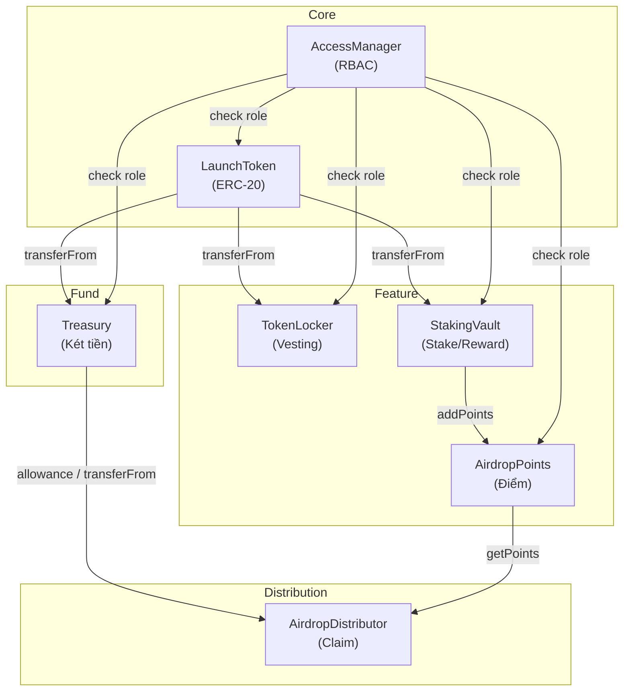
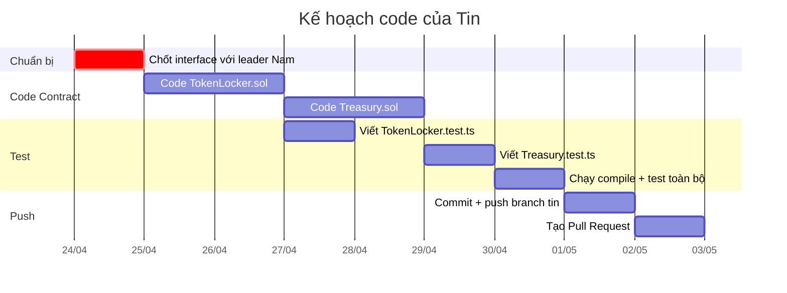

# 📋 KẾ HOẠCH TASK CỦA TIN — Treasury.sol & TokenLocker.sol

---

## 1. TỔNG QUAN HIỂU BIẾT DỰ ÁN

### Kiến trúc hệ thống



### Luồng chính

1. Admin deploy `AccessManager` → deploy `LaunchToken` (mint 1M VLT cho admin)
2. Admin gọi `openTrading()` → hệ thống mở
3. User stake vào `StakingVault` → điểm ghi vào `AirdropPoints`
4. Admin gọi `snapshot()` → fix điểm
5. Admin nạp token vào `Treasury` → `approveSpender` cho `AirdropDistributor`
6. User `claim()` tại `AirdropDistributor` → token từ Treasury → User

### Tokenomics

| Phần | % | Số lượng | Khóa |
|------|---|----------|------|
| 🏗️ Team | 30% | 300,000 VLT | 180 ngày qua TokenLocker |
| 🛒 Public Sale | 20% | 200,000 VLT | Không |
| 💼 Seed/Series A | 20% | 200,000 VLT | Theo thỏa thuận |
| 🎁 Community | 20% | 200,000 VLT | Vào Treasury cho airdrop |
| 🏦 Reserve | 10% | 100,000 VLT | Admin giữ |

---

## 2. PHÂN TÍCH TRẠNG THÁI HIỆN TẠI

### Skeleton code đã có

| File | Trạng thái | Ghi chú |
|------|-----------|---------|
| [AccessManager.sol](file:///c:/Users/ADMIN/Documents/CODE/blockchain/contracts/core/AccessManager.sol) | 🟡 Skeleton | Có constant ADMIN/MINTER/VAULT_ROLE, hàm grantRole/revokeRole/hasRole chưa implement |
| [LaunchToken.sol](file:///c:/Users/ADMIN/Documents/CODE/blockchain/contracts/core/LaunchToken.sol) | 🟡 Skeleton | Có `tradingOpen`, hàm mint/burn/openTrading chưa implement |
| [Treasury.sol](file:///c:/Users/ADMIN/Documents/CODE/blockchain/contracts/fund/Treasury.sol) | 🟡 Skeleton | **Của Tin** - deposit() có `payable` (cần sửa), withdraw, approveSpender |
| [TokenLocker.sol](file:///c:/Users/ADMIN/Documents/CODE/blockchain/contracts/features/TokenLocker.sol) | 🟡 Skeleton | **Của Tin** - Có struct LockInfo, mapping userLocks, hàm lock/unlock |
| [Treasury.test.ts](file:///c:/Users/ADMIN/Documents/CODE/blockchain/test/Treasury.test.ts) | 🟡 Skeleton | 1 test case trống |
| [TokenLocker.test.ts](file:///c:/Users/ADMIN/Documents/CODE/blockchain/test/TokenLocker.test.ts) | 🔴 Trống | File rỗng hoàn toàn |

### Dependencies cần biết

- **OpenZeppelin v5.6.1** đã cài (`@openzeppelin/contracts`)
- **Hardhat v3.3.0** + `hardhat-toolbox-viem` + `hardhat-ethers`
- **Solidity 0.8.28**
- Branch hiện tại: `tin` (đã tách từ `main`)

---

## 3. INTERFACE DEPENDENCY — PHẢI CHỐT VỚI LEADER TRƯỚC

> [!IMPORTANT]
> Trước khi code, Tin cần xác nhận với Nam (leader) về interface của AccessManager và LaunchToken vì 2 contract của Tin **đều phụ thuộc** vào chúng.

### AccessManager — Cần confirm:

```solidity
// Tin cần gọi được:
function hasRole(bytes32 role, address account) external view returns (bool);

// Các role constant:
bytes32 public constant ADMIN_ROLE = keccak256("ADMIN_ROLE");
```

**Câu hỏi cho leader:**
- AccessManager có kế thừa `AccessControl` của OZ không? Nếu có thì `hasRole` đã có sẵn.
- Constructor nhận gì? Hiện tại constructor rỗng — cần biết chính xác.

### LaunchToken — Cần confirm:

```solidity
// Tin cần check trạng thái launch:
bool public tradingOpen;    // đã có trong skeleton

// Tin cần gọi transferFrom (ERC-20 chuẩn):
function transferFrom(address from, address to, uint256 amount) external returns (bool);
function transfer(address to, uint256 amount) external returns (bool);
function approve(address spender, uint256 amount) external returns (bool);
```

**Câu hỏi cho leader:**
- LaunchToken có kế thừa `ERC20` của OZ không? Nếu có thì tất cả function ERC-20 đã có.
- `tradingOpen` check ở đâu? Trong `_update()` override hay trong `transfer()` override?
- TokenLocker cần check `tradingOpen` trước khi lock — Tin nên đọc biến public `tradingOpen` trực tiếp hay gọi qua một getter riêng?

### Giả định tạm thời (nếu leader chưa code xong)

Tin có thể **code trước dựa trên interface giả định** sau, rồi điều chỉnh khi leader push code:

```solidity
// Giả định AccessManager kế thừa OZ AccessControl
interface IAccessManager {
    function hasRole(bytes32 role, address account) external view returns (bool);
}

// Giả định LaunchToken kế thừa OZ ERC20
interface ILaunchToken {
    function tradingOpen() external view returns (bool);
    function transferFrom(address from, address to, uint256 amount) external returns (bool);
    function transfer(address to, uint256 amount) external returns (bool);
    function approve(address spender, uint256 amount) external returns (bool);
}
```

---

## 4. SPEC CHI TIẾT — Treasury.sol

### Mục đích
"Két tiền" giữ token ERC-20 (VLT) cho hệ thống. Không chứa logic airdrop/staking. Chỉ cung cấp API nạp/rút/approve cho admin.

> [!WARNING]
> Skeleton hiện tại có `deposit() external payable` — điều này sai theo tài liệu. Treasury chỉ quản lý ERC-20, **KHÔNG phải native ETH**. Cần bỏ `payable` và chuyển sang dùng `transferFrom`.

### Constructor

```solidity
constructor(address _token, address _accessManager)
```
- Lưu reference tới `LaunchToken` và `AccessManager`
- Không cần logic phức tạp

### State variables

```solidity
IERC20 public token;              // LaunchToken address
IAccessManager public accessManager;  // AccessManager address
```

### Functions

| Hàm | Access | Mô tả |
|-----|--------|-------|
| `deposit(uint256 amount)` | Ai cũng gọi được | Gọi `token.transferFrom(msg.sender, address(this), amount)`. User cần `approve` cho Treasury trước. Emit `Deposited(msg.sender, amount)` |
| `withdraw(address to, uint256 amount)` | Chỉ ADMIN_ROLE | Gọi `token.transfer(to, amount)`. Kiểm tra `amount <= balance`. Emit `Withdrawn(to, amount)` |
| `approveSpender(address spender, uint256 amount)` | Chỉ ADMIN_ROLE | Gọi `token.approve(spender, amount)`. **Xử lý race condition**: reset approve về 0 trước nếu allowance hiện tại > 0. Emit `SpenderApproved(spender, amount)` |
| `getBalance()` | View, ai cũng gọi | Return `token.balanceOf(address(this))` |

### Modifier

```solidity
modifier onlyAdmin() {
    require(accessManager.hasRole(accessManager.ADMIN_ROLE(), msg.sender), "Treasury: not admin");
    _;
}
```

> Hoặc: Nếu dùng `bytes32 constant` thì khai báo local:
> ```solidity
> bytes32 public constant ADMIN_ROLE = keccak256("ADMIN_ROLE");
> ```

### Events

```solidity
event Deposited(address indexed from, uint256 amount);
event Withdrawn(address indexed to, uint256 amount);
event SpenderApproved(address indexed spender, uint256 amount);
```

### Invariants cần đảm bảo

- ✅ Chỉ admin mới withdraw/approveSpender
- ✅ Không withdraw quá balance
- ✅ Approve race condition xử lý đúng (reset 0 trước)
- ✅ Không chứa logic staking/airdrop

---

## 5. SPEC CHI TIẾT — TokenLocker.sol

### Mục đích
Khóa token theo thời gian. Dùng cho team vesting (30% = 300K VLT khóa 180 ngày). Mỗi user có thể tạo nhiều lock riêng biệt.

### Constructor

```solidity
constructor(address _token, address _accessManager)
```
- Lưu reference tới `LaunchToken` và `AccessManager`

### State variables

```solidity
IERC20 public token;
IAccessManager public accessManager;

struct LockInfo {
    uint256 amount;
    uint256 unlockTime;
    bool isReleased;
}

mapping(address => LockInfo[]) public userLocks;
```

### Functions

| Hàm | Access | Mô tả |
|-----|--------|-------|
| `lock(uint256 amount, uint256 duration)` | Ai cũng gọi (sau launch) | Tạo lock mới. `transferFrom` token vào contract. Push vào `userLocks[msg.sender]`. Emit `Locked(msg.sender, lockId, amount, unlockTime)` |
| `unlock(uint256 lockId)` | Chủ lock | Check `lockId` hợp lệ, chưa released, đã qua unlockTime. Transfer token về user. Set `isReleased = true`. Emit `Unlocked(msg.sender, lockId, amount)` |
| `getLockCount(address user)` | View | Return `userLocks[user].length` |
| `getLockInfo(address user, uint256 lockId)` | View | Return thông tin 1 lock cụ thể |

### Modifier / Check

```solidity
// Check trading đã mở chưa (đọc từ LaunchToken)
modifier onlyAfterLaunch() {
    require(ILaunchToken(address(token)).tradingOpen(), "TokenLocker: not launched");
    _;
}
```

### Events

```solidity
event Locked(address indexed user, uint256 indexed lockId, uint256 amount, uint256 unlockTime);
event Unlocked(address indexed user, uint256 indexed lockId, uint256 amount);
```

### Invariants cần đảm bảo

- ✅ Không lock được trước khi `tradingOpen == true`
- ✅ Không unlock trước thời hạn (`block.timestamp < unlockTime` → revert)
- ✅ Không unlock 2 lần (`isReleased == true` → revert)
- ✅ `lockId` không hợp lệ → revert
- ✅ `amount > 0` khi lock
- ✅ User phải `approve` token cho contract trước khi lock

---

## 6. TEST CHECKLIST

### Treasury.test.ts

| # | Test Case | Kỳ vọng |
|---|-----------|---------|
| 1 | Deploy Treasury thành công | Contract có address, token và accessManager đúng |
| 2 | deposit — nạp token thành công | Balance Treasury tăng, balance user giảm |
| 3 | deposit — chưa approve → revert | Revert do ERC-20 allowance |
| 4 | withdraw — admin rút thành công | Balance Treasury giảm, recipient nhận đúng |
| 5 | withdraw — non-admin rút → revert | Revert "not admin" |
| 6 | withdraw — rút quá balance → revert | Revert do ERC-20 insufficient balance |
| 7 | approveSpender — admin approve thành công | Allowance đúng giá trị |
| 8 | approveSpender — non-admin → revert | Revert "not admin" |
| 9 | approveSpender — đổi allowance an toàn | Reset 0 trước rồi set mới, không race condition |
| 10 | getBalance — trả đúng balance | Khớp với `token.balanceOf(treasury)` |

### TokenLocker.test.ts

| # | Test Case | Kỳ vọng |
|---|-----------|---------|
| 1 | Deploy TokenLocker thành công | Contract có address, references đúng |
| 2 | lock — trước khi launch → revert | Revert "not launched" |
| 3 | lock — sau launch, thành công | LockInfo được tạo, token chuyển vào contract |
| 4 | lock — amount = 0 → revert | Revert |
| 5 | lock — chưa approve → revert | Revert do ERC-20 |
| 6 | lock — nhiều lock cho 1 user | Mỗi lock có lockId riêng |
| 7 | unlock — trước thời hạn → revert | Revert "not yet" |
| 8 | unlock — đúng thời hạn, thành công | Token trả về user, isReleased = true |
| 9 | unlock — 2 lần cùng lockId → revert | Revert "already released" |
| 10 | unlock — lockId không tồn tại → revert | Revert index out of bounds |
| 11 | getLockCount — trả đúng số lượng | Đếm đúng |
| 12 | getLockInfo — trả đúng thông tin | Khớp amount, unlockTime, isReleased |

---

## 7. THỨ TỰ THỰC HIỆN TỐI ƯU



### Bước cụ thể:

| Bước | Việc | Ưu tiên |
|------|------|---------|
| **0** | Chat/confirm interface với Nam (AccessManager, LaunchToken) | 🔴 Bắt buộc trước |
| **1** | Code `TokenLocker.sol` — phạm vi hẹp, ít dependency, dễ test | ⭐ Làm trước |
| **2** | Viết `TokenLocker.test.ts` ngay sau khi code xong contract | ⭐ Test ngay |
| **3** | Code `Treasury.sol` — tương tự nhưng có thêm logic approve | Làm tiếp |
| **4** | Viết `Treasury.test.ts` | Test ngay |
| **5** | `npx hardhat compile` — fix lỗi nếu có | Verify |
| **6** | `npx hardhat test` — pass hết mới commit | Verify |
| **7** | `git add . && git commit -m "TV2: Hoan thanh Treasury va TokenLocker"` | Push |
| **8** | `git push origin tin` → Tạo PR trên GitHub | Push |

---

## 8. LƯU Ý QUAN TRỌNG

> [!CAUTION]
> **Vấn đề skeleton Treasury.sol:** Hàm `deposit()` hiện có `payable` — điều này dùng cho native ETH. Theo tài liệu, Treasury chỉ quản lý ERC-20 token (VLT). **Phải bỏ `payable`** và chuyển sang dùng `transferFrom(msg.sender, address(this), amount)`.

> [!WARNING]
> **Vấn đề team size:** README ghi 4 người, file phân chia công việc ghi 5 người. Không ảnh hưởng code nhưng cần thống nhất trong báo cáo.

> [!TIP]
> **Trick test TokenLocker:** Trong test, để test unlock mà không đợi thật, dùng `time.increase()` của Hardhat:
> ```typescript
> import { time } from "@nomicfoundation/hardhat-toolbox-viem/network-helpers";
> await time.increase(180 * 24 * 60 * 60); // tua 180 ngày
> ```

> [!TIP]
> **Trick mock AccessManager/LaunchToken trong test:** Vì leader có thể chưa code xong, Tin có thể **tự viết bản implement tối thiểu** của AccessManager và LaunchToken trong test setup để test độc lập. Khi leader push code thật thì đổi lại.

> [!NOTE]
> **Về báo cáo Word:** Tin chỉ viết phần nhẹ — Chương 1 cơ sở lý thuyết (định nghĩa ERC-20, Hardhat, Solidity ngắn gọn) + bảng Tokenomics. Có thể lấy thông tin trực tiếp từ file `ke_hoach_token_erc20.md`.
