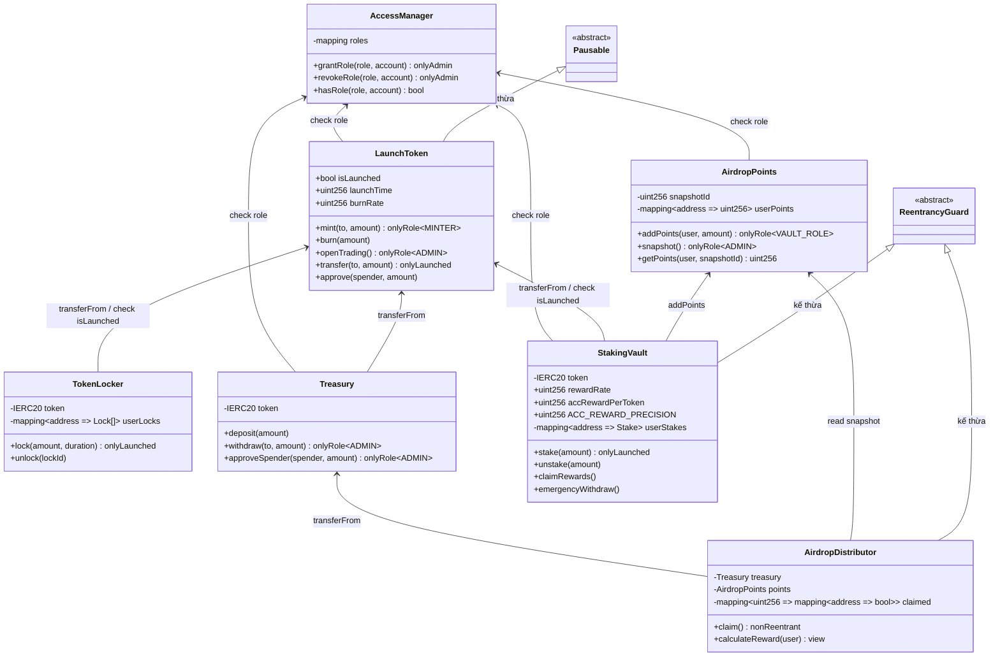
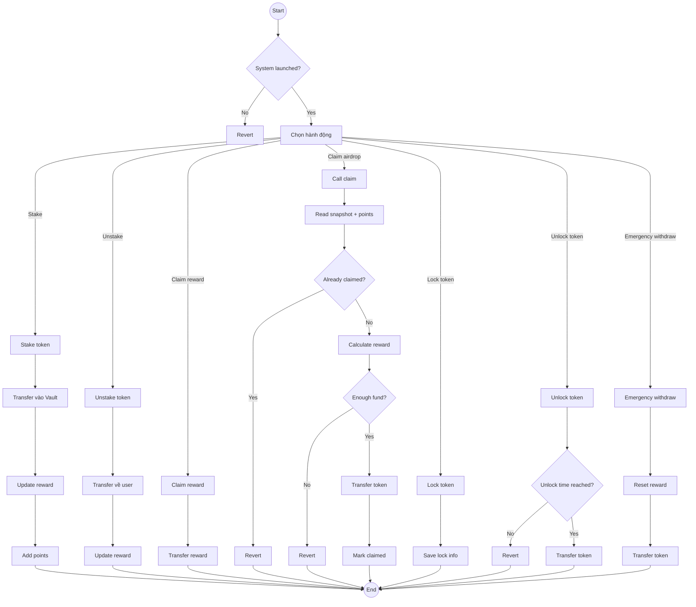
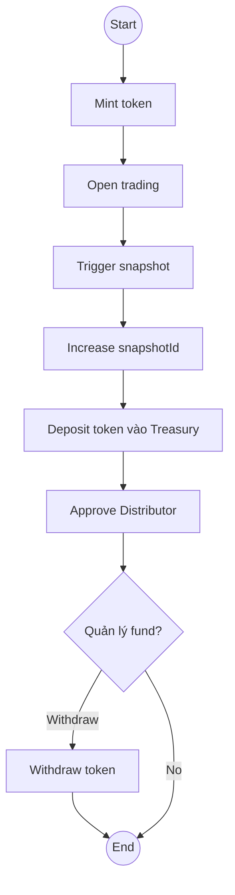
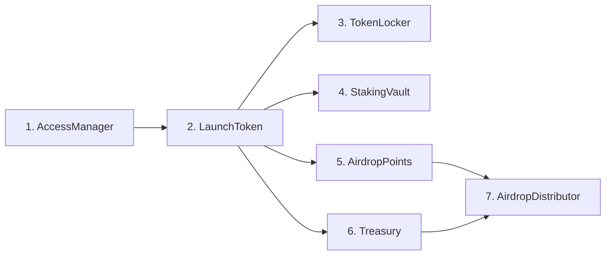

# KIẾN TRÚC HỆ THỐNG — VaultToken ERC-20 DeFi Ecosystem

> Tài liệu này mô tả toàn bộ kiến trúc hệ thống gồm 7 smart contract.
> Phải hiểu rõ kiến trúc trước khi bắt đầu code.

---

## 1. Sơ đồ lớp (Class Diagram)

> Mô tả cấu trúc từng contract: biến trạng thái, hàm, modifier, và quan hệ giữa các contract.

### Nhận xét sơ đồ lớp

**Hệ thống gồm 7 contract chính chia thành 4 tầng (layer):**

- **Tầng Core (nền tảng):** `AccessManager` và `LaunchToken` — đây là 2 contract nền tảng mà tất cả contract khác đều phải phụ thuộc. AccessManager quản lý toàn bộ quyền (ai là Admin, ai là Minter, ai là Vault), còn LaunchToken là token ERC-20 duy nhất trong hệ thống, mọi thao tác chuyển/nhận token đều đi qua nó.

- **Tầng Feature (tính năng):** `TokenLocker`, `StakingVault`, `AirdropPoints` — là các contract cung cấp tính năng cho người dùng. TokenLocker cho phép khóa token theo thời gian (vesting). StakingVault cho phép gửi token để nhận phần thưởng. AirdropPoints ghi nhận điểm thưởng nhưng không giữ token.

- **Tầng Fund (quỹ):** `Treasury` — đóng vai trò "két tiền" duy nhất, chỉ giữ token và cấp quyền rút cho contract khác. Không chứa logic nghiệp vụ nào.

- **Tầng Distribution (phân phối):** `AirdropDistributor` — contract cuối cùng trong chuỗi, đọc điểm từ AirdropPoints rồi rút token từ Treasury để trả cho người dùng.

**Về quan hệ phụ thuộc:**

- Mũi tên `check role` nghĩa là contract gọi `hasRole()` của AccessManager để kiểm tra quyền trước khi cho phép thực hiện hành động (ví dụ: chỉ ADMIN mới được gọi `withdraw` trong Treasury).
- Mũi tên `transferFrom` nghĩa là contract gọi hàm chuyển token ERC-20 tiêu chuẩn — người dùng phải `approve` trước cho contract đó.
- Mũi tên `addPoints` là StakingVault tự động ghi điểm vào AirdropPoints mỗi khi user stake.
- `ReentrancyGuard` và `Pausable` là 2 abstract contract từ OpenZeppelin dùng để bảo vệ chống tấn công reentrancy và cho phép tạm dừng hệ thống.

**Điểm quan trọng:** Dấu `-` trước biến nghĩa là private/internal (chỉ contract đó truy cập được), dấu `+` nghĩa là public/external (bên ngoài gọi được). Modifier sau tên hàm (như `onlyAdmin`, `onlyRole`, `onlyLaunched`, `nonReentrant`) là các điều kiện bắt buộc phải thỏa trước khi hàm được thực thi.

---

## 2. Sơ đồ luồng hoạt động người dùng (User Activity Flow)

> Mô tả toàn bộ hành động mà người dùng có thể thực hiện sau khi hệ thống launch.

### Nhận xét sơ đồ luồng người dùng

**Điểm chốt đầu tiên — "System launched?":**
Mọi hành động của người dùng đều phải qua bước kiểm tra hệ thống đã launch chưa (biến `isLaunched` / `tradingOpen` trong LaunchToken). Nếu chưa launch → tất cả đều bị **Revert** (giao dịch thất bại, không thực hiện được). Đây là cơ chế bảo vệ để admin có thời gian thiết lập xong hệ thống trước khi cho phép giao dịch.

**7 hành động người dùng có thể làm:**

1. **Stake** — Gửi token vào StakingVault. Luồng: chuyển token vào vault → cập nhật phần thưởng tích lũy → tự động cộng điểm vào AirdropPoints. Điểm này sẽ quyết định user nhận được bao nhiêu airdrop sau này.

2. **Unstake** — Rút token ra khỏi vault. Luồng: chuyển token về ví user → cập nhật lại reward. Sau khi unstake, user không còn tích thêm điểm nữa.

3. **Claim reward** — Nhận phần thưởng staking (nếu hệ thống có cơ chế lãi riêng). Chỉ đơn giản là chuyển reward đã tích lũy về user.

4. **Claim airdrop** — Luồng phức tạp nhất, có 2 lần kiểm tra:
   - Kiểm tra 1: User đã claim đợt này chưa? → Nếu rồi thì Revert (chống double claim).
   - Kiểm tra 2: Treasury còn đủ tiền không? → Nếu hết quỹ thì Revert.
   - Nếu qua cả 2 → tính reward theo điểm → chuyển token → đánh dấu đã claim.

5. **Lock token** — Khóa token vào TokenLocker. Đơn giản: chuyển token vào contract, lưu thông tin khóa (số lượng, thời điểm mở khóa). Dùng cho team vesting 30% token.

6. **Unlock token** — Rút token đã khóa. Có kiểm tra thời gian: nếu chưa đến hạn → Revert, đến hạn rồi → chuyển token về user.

7. **Emergency withdraw** — Rút khẩn cấp khỏi StakingVault. Khác với unstake bình thường ở chỗ: sẽ **reset toàn bộ reward về 0** (mất hết phần thưởng), chỉ trả lại vốn gốc. Dùng khi hệ thống gặp sự cố.

**Quy tắc chung:** Mọi nhánh "Revert" đều có nghĩa là giao dịch thất bại hoàn toàn, gas fee vẫn bị trừ nhưng không có thay đổi nào xảy ra trên blockchain.

---

## 3. Sơ đồ luồng hoạt động Admin (Admin Flow)

> Mô tả các bước admin thực hiện để thiết lập và vận hành hệ thống.

### Nhận xét sơ đồ luồng Admin

**Đây là "playbook" mà admin phải làm theo đúng thứ tự từ trên xuống:**

1. **Mint token** — Admin (hoặc tài khoản có MINTER_ROLE) gọi `mint()` trên LaunchToken để tạo ra 1,000,000 VLT ban đầu. Token được mint vào ví admin.

2. **Open trading** — Admin gọi `openTrading()` để bật cờ `isLaunched = true`. Từ lúc này trở đi, toàn bộ hệ thống mới cho phép user tương tác (transfer, stake, lock...). **Bước này không thể đảo ngược** — một khi đã mở thì không tắt được.

3. **Trigger snapshot** — Admin gọi `snapshot()` trên AirdropPoints để "chụp ảnh" điểm của tất cả user tại thời điểm đó. Mỗi lần snapshot sẽ tạo ra một `snapshotId` mới, dùng để phân biệt các đợt airdrop khác nhau.

4. **Increase snapshotId** — Hệ thống tự động tăng snapshotId lên 1 đơn vị. Mỗi đợt airdrop có một snapshotId riêng, đảm bảo tách biệt giữa các đợt.

5. **Deposit token vào Treasury** — Admin chuyển token (ví dụ 200,000 VLT phần Community) vào contract Treasury. Treasury chỉ giữ token, không tự phân phối.

6. **Approve Distributor** — Admin gọi `approveSpender()` trên Treasury để cấp allowance cho AirdropDistributor. Nghĩa là cho phép Distributor được rút tối đa X token từ Treasury. Nếu không có bước này, Distributor không thể lấy token để trả cho user.

7. **Quản lý fund?** — Vòng lặp tùy chọn: admin có thể gọi `withdraw()` để rút token từ Treasury khi cần (ví dụ: chuyển sang quỹ khác, hoặc xử lý khẩn cấp). Nếu không cần thì kết thúc.

**Lưu ý quan trọng:** Thứ tự các bước phải đúng. Không thể snapshot trước khi open trading (vì chưa ai stake được nên điểm = 0). Không thể approve distributor trước khi deposit (vì Treasury chưa có token). Nếu làm sai thứ tự, hệ thống sẽ hoạt động không đúng hoặc user sẽ claim được 0 token.

---

## 4. Bảng tổng hợp quan hệ giữa các contract

| Contract nguồn | Gọi tới | Hàm / Quan hệ |
|----------------|---------|----------------|
| LaunchToken | AccessManager | `hasRole()` — check MINTER_ROLE, ADMIN_ROLE |
| TokenLocker | LaunchToken | `transferFrom()`, đọc `isLaunched` |
| Treasury | LaunchToken | `transferFrom()`, `transfer()`, `approve()` |
| Treasury | AccessManager | `hasRole()` — check ADMIN_ROLE |
| StakingVault | LaunchToken | `transferFrom()`, đọc `isLaunched` |
| StakingVault | AirdropPoints | `addPoints()` |
| StakingVault | AccessManager | `hasRole()` — check role |
| AirdropPoints | AccessManager | `hasRole()` — check VAULT_ROLE, ADMIN_ROLE |
| AirdropDistributor | Treasury | `transferFrom()` — rút token qua allowance |
| AirdropDistributor | AirdropPoints | `getPoints()` — đọc điểm theo snapshot |

### Nhận xét bảng quan hệ

- **AccessManager là trung tâm quyền lực:** 4 contract (LaunchToken, Treasury, StakingVault, AirdropPoints) đều phải hỏi AccessManager trước khi thực hiện hành động đặc quyền. Nếu AccessManager chưa deploy hoặc cấu hình sai role → toàn bộ hệ thống tê liệt.

- **LaunchToken là trung tâm tài sản:** 3 contract (TokenLocker, Treasury, StakingVault) đều gọi `transferFrom()` của LaunchToken để chuyển token. Nghĩa là user phải `approve()` cho từng contract trước khi tương tác.

- **AirdropPoints là cầu nối:** Nhận điểm từ StakingVault (ghi vào) và cung cấp điểm cho AirdropDistributor (đọc ra). Bản thân nó không giữ token nào.

- **Treasury → AirdropDistributor:** Đây là dòng tiền duy nhất khi user claim airdrop. Distributor không tự giữ token, mà dùng `transferFrom()` để rút từ Treasury thông qua allowance mà admin đã approve trước đó.

---

## 5. Thứ tự deploy bắt buộc

### Nhận xét thứ tự deploy

- **AccessManager phải deploy đầu tiên (bước 1)** vì nó là hệ thống phân quyền. Tất cả contract khác đều cần truyền địa chỉ AccessManager vào constructor để biết hỏi quyền ở đâu.

- **LaunchToken deploy thứ 2 (bước 2)** vì nó là token ERC-20 duy nhất. Các contract bước 3-6 đều cần biết địa chỉ token để gọi `transferFrom()`, `approve()`...

- **Bước 3, 4, 5, 6 có thể deploy song song** (TokenLocker, StakingVault, AirdropPoints, Treasury) vì chúng không phụ thuộc lẫn nhau. Chỉ cần đã có địa chỉ AccessManager và LaunchToken.

- **AirdropDistributor phải deploy cuối cùng (bước 7)** vì constructor của nó cần địa chỉ cả Treasury lẫn AirdropPoints — hai contract phải tồn tại trước.

- **Sau khi deploy xong tất cả:** Admin cần gọi `grantRole()` trên AccessManager để cấp VAULT_ROLE cho StakingVault, cấp MINTER_ROLE cho tài khoản cần mint. Nếu quên bước này, StakingVault sẽ không thể gọi `addPoints()` trên AirdropPoints.
