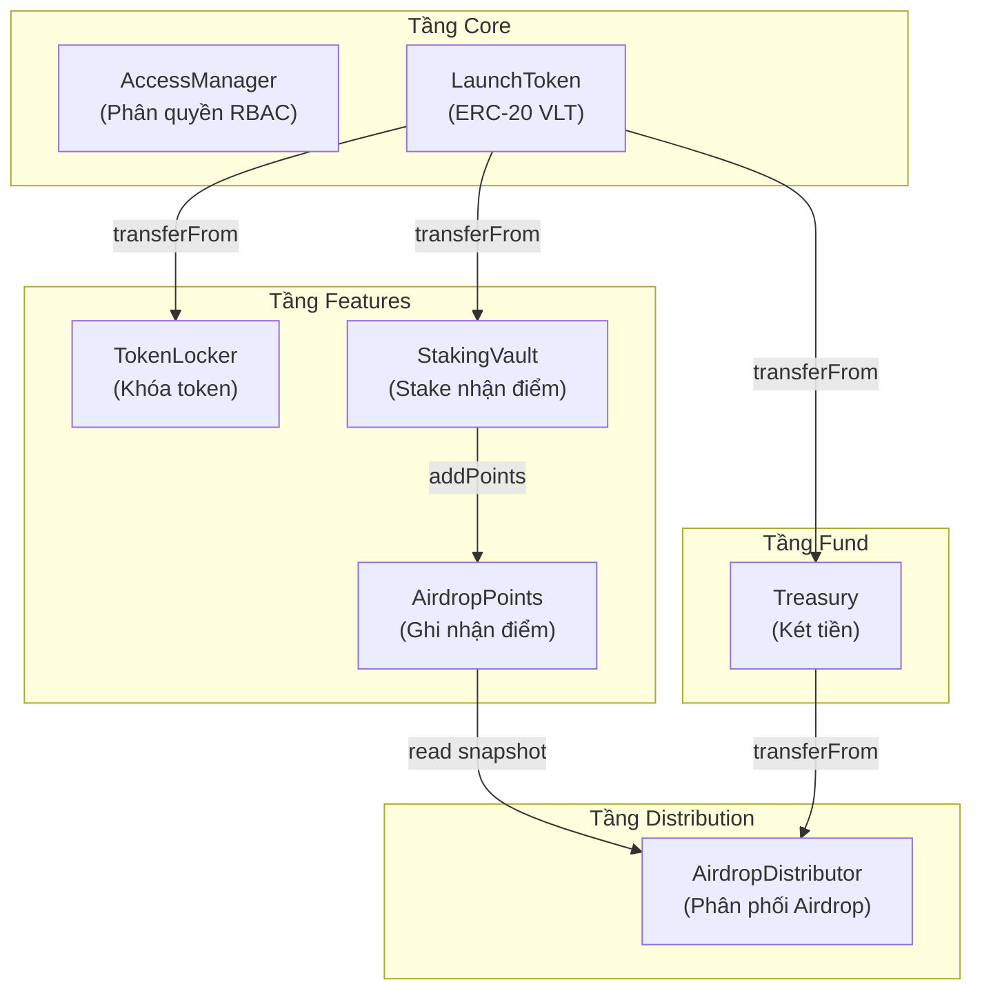
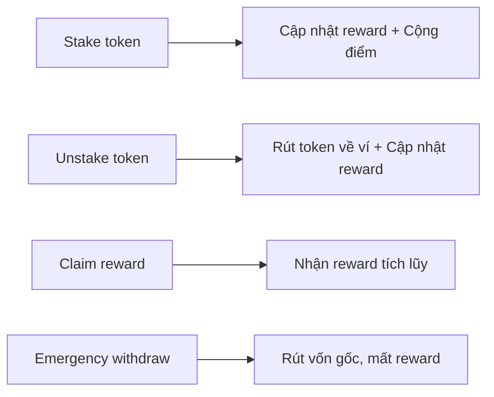
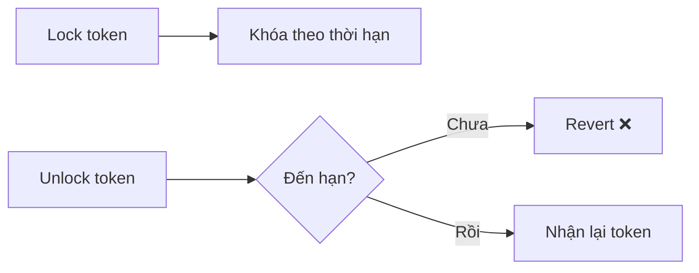
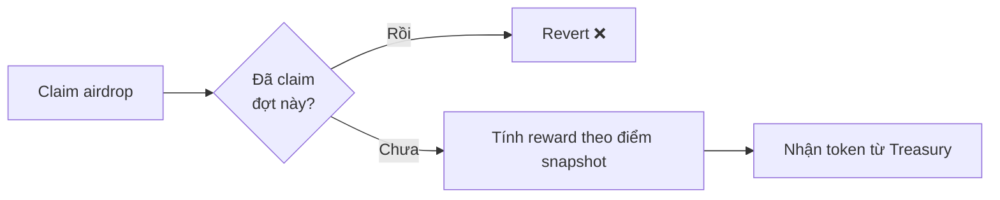

# SƠ ĐỒ ĐƠN GIẢN — Dùng cho Slide Chương 3

> Hai sơ đồ dưới đây được viết lại từ `kientruchethong.md`, phong cách đơn giản tương tự **Admin Flow** và **Thứ tự deploy**.

---

## 1. Sơ đồ lớp đơn giản (Class Diagram — Simplified)

> Chỉ hiển thị **tên contract**, **layer** và **quan hệ chính** giữa các contract.
> Bỏ chi tiết hàm/biến bên trong để tránh rối khi trình chiếu.

### Cách đọc sơ đồ

| Ký hiệu | Ý nghĩa |
|----------|---------|
| **check role** | Contract gọi `hasRole()` của AccessManager để kiểm tra quyền |
| **transferFrom** | Contract gọi hàm chuyển token ERC-20, user phải `approve` trước |
| **addPoints** | StakingVault tự động ghi điểm vào AirdropPoints khi user stake |
| **read snapshot** | AirdropDistributor đọc điểm từ AirdropPoints theo đợt snapshot |

> **Lưu ý kế thừa:** StakingVault và AirdropDistributor kế thừa `ReentrancyGuard` (chống tấn công reentrancy). LaunchToken kế thừa `Pausable` (cho phép tạm dừng hệ thống).

---

## 2. Sơ đồ luồng hoạt động người dùng — Đơn giản (User Activity Flow — Simplified)

> **Điều kiện tiên quyết:** Hệ thống phải đã `launch` (tradingOpen = true), nếu chưa → mọi hành động đều Revert.

### 2.1 Luồng Staking

### 2.2 Luồng Token Locking

### 2.3 Luồng Claim Airdrop

### Tóm tắt 3 nhóm hành động

| Nhóm | Hành động | Mô tả ngắn |
|------|-----------|-------------|
| **Staking** | Stake, Unstake, Claim reward, Emergency withdraw | Gửi/rút token vào StakingVault, nhận điểm thưởng |
| **Token Locking** | Lock, Unlock | Khóa token theo thời hạn (dùng cho Team vesting) |
| **Airdrop** | Claim airdrop | Nhận token từ Treasury dựa trên điểm snapshot |

### Quy tắc chung

- **Mọi hành động** đều phải qua bước kiểm tra "Hệ thống đã launch?" — nếu chưa thì Revert.
- **Revert** = giao dịch thất bại hoàn toàn, không có thay đổi nào trên blockchain.
- **Emergency withdraw** khác Unstake: trả lại vốn gốc nhưng **mất toàn bộ reward**.

---

## So sánh: Sơ đồ cũ vs Sơ đồ mới

| Tiêu chí | Sơ đồ cũ | Sơ đồ mới |
|----------|----------|-----------|
| **Class Diagram** | Liệt kê hàm, biến, modifier bên trong mỗi class → nhiều text, khó đọc trên slide | Chỉ hiện tên contract + layer + quan hệ → gọn, dễ nhìn |
| **User Flow** | 7 nhánh riêng biệt, nhiều node trung gian → đường nối chồng chéo | Gom thành 3 nhóm, giảm node trung gian → luồng rõ ràng |
| **Phù hợp** | Đọc tài liệu chi tiết | Trình chiếu slide, thuyết trình |
